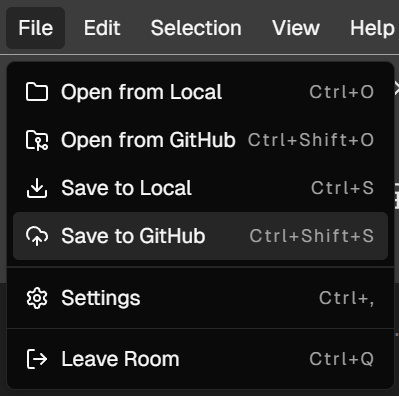

# CodeX User Manual

- [CodeX User Manual](#codex-user-manual)
  - [Getting Started](#getting-started)
    - [Accessing CodeX](#accessing-codex)
    - [Creating a Room](#creating-a-room)
    - [Joining a Room](#joining-a-room)
      - [Using a Room ID](#using-a-room-id)
      - [Using an Invite Link](#using-an-invite-link)
      - [Scanning QR Code](#scanning-qr-code)
    - [User Interface Overview](#user-interface-overview)
      - [Top Bar](#top-bar)
      - [Main Work Area (Split into Panels)](#main-work-area-split-into-panels)
      - [Bottom Panel](#bottom-panel)
      - [Status Bar](#status-bar)
  - [Room Sharing](#room-sharing)
    - [Room ID](#room-id)
    - [Invite Link](#invite-link)
    - [QR Code](#qr-code)
  - [Code Editor](#code-editor)
    - [Cursor](#cursor)
    - [Text Selection](#text-selection)
    - [Code Editor Settings](#code-editor-settings)
  - [Follow Mode](#follow-mode)
    - [Enabling Follow Mode](#enabling-follow-mode)
    - [Limitations](#limitations)
  - [Code Execution](#code-execution)
    - [Passing Arguments and Input (stdin)](#passing-arguments-and-input-stdin)
  - [Shared Terminal](#shared-terminal)
    - [Download Output](#download-output)
    - [Clear Output](#clear-output)
  - [GitHub Integration](#github-integration)
    - [Authentication](#authentication)
    - [Disconnecting GitHub Account](#disconnecting-github-account)
    - [Opening Files from GitHub](#opening-files-from-github)
    - [Saving Files to GitHub](#saving-files-to-github)
  - [Live Preview](#live-preview)
    - [Enabling/Disabling Live Preview](#enablingdisabling-live-preview)
    - [Limitations of Live Preview](#limitations-of-live-preview)
    - [Live Preview Example](#live-preview-example)
      - [Example 1: HTML with Tailwind CSS](#example-1-html-with-tailwind-css)
      - [Example 2: HTML with Alpine.js, GSAP, and Chart.js](#example-2-html-with-alpinejs-gsap-and-chartjs)
  - [Notepad](#notepad)
    - [Notepad Features](#notepad-features)
    - [Markdown Support](#markdown-support)
    - [Limitations of Notepad](#limitations-of-notepad)
    - [Saving and Opening Notes](#saving-and-opening-notes)
      - [Saving Notes](#saving-notes)
      - [Opening Notes](#opening-notes)
  - [Video \& Voice Communication](#video--voice-communication)
  - [Troubleshooting](#troubleshooting)
    - [Live Preview not Updating or Displaying Error](#live-preview-not-updating-or-displaying-error)
    - [Follow Mode not working](#follow-mode-not-working)
    - [Code is not Syncing Between Users](#code-is-not-syncing-between-users)
    - [This language may not be supported or the server is down](#this-language-may-not-be-supported-or-the-server-is-down)
    - [No code to execute](#no-code-to-execute)
    - [Error parsing markdown](#error-parsing-markdown)
    - [Please check the information and try again](#please-check-the-information-and-try-again)
    - [Failed to import settings. Please check the file format](#failed-to-import-settings-please-check-the-file-format)
    - [Parsing of the Following Markdown Structure Failed](#parsing-of-the-following-markdown-structure-failed)
    - [Error accessing media devices](#error-accessing-media-devices)
    - [Please grant `media-device` permissions to see available devices](#please-grant-media-device-permissions-to-see-available-devices)
    - [Error enumerating devices](#error-enumerating-devices)
    - [Error toggling `media-device`](#error-toggling-media-device)
    - [Error Setting Audio Output](#error-setting-audio-output)
    - [No active media stream](#no-active-media-stream)
    - [No audio track found](#no-audio-track-found)
    - [Error creating peer connection](#error-creating-peer-connection)
    - [Performance Tips](#performance-tips)
  - [Security Considerations](#security-considerations)
  - [Privacy and Security](#privacy-and-security)
    - [Data Handling](#data-handling)
    - [User Privacy](#user-privacy)
    - [GitHub Access Permissions](#github-access-permissions)
  - [Appendix](#appendix)
    - [Supported Editor Languages](#supported-editor-languages)
    - [Supported Execution Languages](#supported-execution-languages)
    - [Keyboard Shortcuts in Menu Bar](#keyboard-shortcuts-in-menu-bar)
    - [Pre-Installed Libraries for Live Preview](#pre-installed-libraries-for-live-preview)
    - [Notepad Features and Markdown Syntax](#notepad-features-and-markdown-syntax)

## Getting Started

### Accessing CodeX

CodeX is a web-based application that requires no installation. To access CodeX:

1. Open your web browser
2. Navigate to [https://codex.dulapahv.dev/](https://codex.dulapahv.dev/).
3. The platform will load automatically in your browser

### Creating a Room

To create a new coding session:

1. On the homepage, locate the `Create a Room` section
2. Enter your preferred display name in the `Name` field
3. Click `+ Create Room` to start a new session
4. You'll be automatically redirected to your coding room

<div align="center">
  
</div>

### Joining a Room

A valid room ID must be in a `XXXX-XXXX` format where `X` is an alphanumeric character.

There are three ways to join an existing room:

#### Using a Room ID

1. On the homepage, find the `Join a Room` section
2. Input the room ID provided by the room creator in the `Room ID` field.
   > When inputting the room ID, no need to include the hyphen `-` as it will be added automatically.
3. Enter your display name in the `Name` field
4. Click `Join Room →`

<div align="center">
  
</div>

#### Using an Invite Link

1. Click the invite link shared with you
2. Enter your display name in the `Name` field when prompted
3. Click `Join Room →`

<div align="center">
  
</div>

#### Scanning QR Code

1. Use your mobile device to scan the QR code shared by the room creator
2. Enter your display name in the `Name` field when prompted
3. Click `Join Room →`

<div align="center">
  
</div>

### User Interface Overview

Once you enter a room, you'll see several key interface elements.
The interface is divided into several sections, each section contains multiple panels.

- Panels can be resized by dragging the dividers
- Panels can be hidden/shown using toolbar buttons (`view > panel name`)

<div align="center">
  
</div>

#### Top Bar

<div align="center">
  
</div>

1. **Menu Bar**
   - Contains File, Edit, Selection, View, and Help menus
2. **Run Code Button**
   - Execute your code directly from the editor
   - For list of supported execution languages, refer to the [Supported Execution Languages](#supported-execution-languages) section
3. **User List**
   - Displays the list of users in the room
4. **Share Button**
   - Share your room with others via a link or QR code
5. **Follow User**
   - Opens a dropdown to follow another user's actions
6. **Settings**
   - Connect to GitHub, and adjust editor settings

#### Main Work Area (Split into Panels)

<div align="center">
  
</div>

1. **Left Most Panel - Notepad**

   - Rich text formatting toolbar (Bold, Italic, Underline, etc.)
   - Block type selector for different content types
   - Collaborative note-taking area
   - Table and media insertion tools

2. **Center Left Panel - Code Editor**

   - Main coding area with syntax highlighting
   - Line numbers
   - Real-time collaboration
   - Multi-cursor support

3. **Right Right Panel - Live Preview**
   - Live preview of code output
   - UI rendering for web development
   - Real-time updates

4. **Right Most Panel - Video & Voice Communication**
   - Video and voice communication controls
   - Toggle camera, microphone, and audio settings
   - See and hear other participants

#### Bottom Panel

<div align="center">
  
</div>

1. **Terminal**

- Shared terminal with welcome message
- Command output display
- Download and clear outputs options
- Color-coded text output

#### Status Bar

<div align="center">
  
</div>

1. **Language Selector:**
   - Shows current programming language (e.g., "HTML")
   - For list of supported editor languages, refer to the [Supported Editor Languages](#supported-editor-languages) section
2. **Line and Column Indicator:**
   - Shows cursor position in the editor

## Room Sharing

CodeX allows you to share your room with others using multiple methods:

<div align="center">
  
</div>

<div align="center">
  
</div>

### Room ID

1. Click the `Share` button in the top bar
2. Copy the room ID from the `Room ID` field

### Invite Link

1. Click the `Share` button in the top bar
2. Click the `Copy Invite Link` button

### QR Code

1. Click the `Share` button in the top bar

## Code Editor

The Monaco Editor forms the core of CodeX's collaborative coding environment, enabling multiple users to code together in real-time. Key features include:

- Real-time synchronization of code changes across all participants
- Multi-cursor support showing everyone's positions
- Syntax highlighting for over 90 programming languages (For a list of supported editor languages, refer to the [Supported Editor Languages](#supported-editor-languages) section)
- Intellisense for code completion
- Error detection and linting
- You can configure, import and export editor settings to customize your coding environment. Learn more in the [Code Editor Settings](#code-editor-settings) section
- The editor supports multiple shortcuts for common actions. Refer to the [Keyboard Shortcuts in Menu Bar](#keyboard-shortcuts-in-menu-bar) section for a list of supported shortcuts

### Cursor

Each participant's cursor is displayed with a unique color. The color is generated from user name and is consistent across all participants

- Cursor labels show usernames and colors
- Cursor positions are updated in real-time as users type or move
- Cursor labels appear above the text by default, and appear below when at the first line of the editor

<div align="center">
  
</div>

### Text Selection

- Active selections are highlighted for all participants
- Selection highlights appear in both the main editor and minimap
- Multiple concurrent selections from different users are supported
- Selection information (character count) is displayed in the lower right corner of the status bar

<div align="center">
  
</div>

### Code Editor Settings

You can configure the code editor as well as its theme to suit your preferences by going to `Settings` in the upper right corner of the top bar.

<div align="center">
  
</div>

- To import settings, click on the `Import Settings` button and upload a JSON file
- To export settings, click on the `Export Settings` button to download a JSON file

The settings are persisted across sessions and are stored in your browser's local storage.

<div align="center">
  
</div>

## Follow Mode

Follow Mode allows users to track another participant's actions in real-time by syncing their view with the followed user's view.

### Enabling Follow Mode

1. Click on the Follow User button in the upper right corner of the top bar

    <div align="center">
      
    </div>

2. Select or search for the user you want to follow

    <div align="center">
      
    </div>

3. Your editor view will now sync with the selected user's actions

### Limitations

- You cannot follow a user who is already following you
- You cannot follow a user who is already following another user

## Code Execution

<div align="center">
  
</div>

You can execute code directly from the editor using the `Run Code` button in the top bar. The output will be displayed in the [Shared Terminal](#shared-terminal).

For a list of supported execution languages, refer to the [Supported Execution Languages](#supported-execution-languages) section.

### Passing Arguments and Input (stdin)

You can pass arguments to your code by:

<div align="center">
  
</div>

1. Click on the arrow down icon next to the `Run Code` button
2. Enter your arguments or input in the text area

Arguments and Input must be separated by a newline. For example:

```txt
input1
42 Bangkok
1 2 3
```

Empty lines are ignored. You can also use `'` and `"` in your arguments and input.

## Shared Terminal

The Shared Terminal allows you to execute commands and view the output in real-time. The terminal is shared among all participants in the room.

At the upper right corner of the terminal panel, you can [Download Output](#download-output) or [Clear Output](#clear-output).

<div align="center">
  
</div>

### Download Output

File name will be `codex-terminal-<date>--<time>.txt`, for example `codex-terminal-06-01-2025--17-37-28.txt`

- Terminal output will not contain CodeX welcome message
- Example output file:

    ```txt
    [18:35:33.060]
    🚀 Executing code...

    [18:35:33.760] - python v3.10.0 (700ms)
    Hello World
    ```

### Clear Output

- Clear the terminal output

## GitHub Integration

CodeX allows you to connect your GitHub account to open and save files directly from your repositories.

### Authentication

CodeX requires `repo` access scope to read and write to your repositories. For more information, refer to the [GitHub Access Permissions](#github-access-permissions) section.

To connect your GitHub account:

<div align="center">
  
</div>

1. Click on the `Settings` button in the top bar
2. Click on the `Connect to GitHub` button
3. Follow the prompts to authenticate your GitHub account
4. Once connected, you can open and save files from your GitHub repositories

### Disconnecting GitHub Account

To disconnect your GitHub account:

<div align="center">
  
</div>

1. Click on the `Settings` button in the top bar
2. Click on the `Disconnect` button

### Opening Files from GitHub

1. Click on the `File` menu in the top bar

    <div align="center">
      
    </div>

2. Click on `Open from GitHub`
   - If you are not connected to GitHub, you will be prompted to connect your account
   - If the current code editor is not empty, a confirmation dialog will appear asking if you want to replace the current code with the file from GitHub
      <div align="center">
        
      </div>
3. Select the repository, branch, and file you want to open
4. The file will be loaded into the editor

<div align="center">
  
</div>

CodeX will automatically detect the language of the file and switch the editor's language mode accordingly. Other users' editors will also automatically switch to the same language mode.

### Saving Files to GitHub

1. Click on the `File` menu in the top bar

<div align="center">
  
</div>

2. Click on `Save to GitHub`
    - If you are not connected to GitHub, you will be prompted to connect your account
3. Enter the file name and commit message
4. Click `Save`

<div align="center">
  
</div>

Upon saving, an alert will appear at the bottom right corner of the screen indicating the success or failure of the save operation. From there, you can click on the link to view the commit on GitHub.

<div align="center">
  
</div>

## Live Preview

The Live Preview panel allows you to see real-time updates of your code output. It is particularly useful for web development to see how your code renders in a browser.

<div align="center">
  
</div>

- Tailwind CSS utility classes are available
- Add custom styles with `<style>` tags
- Add custom scripts with `<script>` tags
- Add external libraries in `<head>` tags

For a list of pre-installed libraries, refer to the [Pre-Installed Libraries for Live Preview](#pre-installed-libraries-for-live-preview) section.

### Enabling/Disabling Live Preview

1. Click on the `View` menu in the top bar
2. Click on `Live Preview`

<div align="center">
  
</div>

### Limitations of Live Preview

- Only HTML code is supported

### Live Preview Example

#### Example 1: HTML with Tailwind CSS

```html
<style>
  .test {
    background-color: blue;
  }
</style>

<p class="test text-5xl text-white font-bold">
  Hello World
</p>
```

<div align="center">
  
</div>

#### Example 2: HTML with Alpine.js, GSAP, and Chart.js

```html
<div class="bg-black p-4 h-full">
  <div class="mx-auto max-w-4xl space-y-4">
    <!-- Alpine.js example -->
    <div
      x-data="{ count: 0 }"
      class="rounded-lg bg-neutral-900 p-6 shadow-lg"
    >
      <div class="mb-4 flex items-center gap-2">
        <i data-lucide="plus-circle" class="size-5 text-blue-500"></i>
        <h2 class="text-xl font-semibold text-neutral-50">
          Interactive Counter
        </h2>
      </div>
      <button
        @click="count++"
        class="rounded bg-blue-500 px-4 py-2 text-white transition-colors hover:bg-blue-600"
        data-tippy-content="Click me to increment!"
      >
        Count: <span x-text="count" class="font-bold"></span>
      </button>
    </div>

    <!-- GSAP example -->
    <div id="gsap-box" class="rounded-lg bg-neutral-900 p-6 shadow-lg">
      <div class="mb-4 flex items-center gap-2">
        <i data-lucide="move-3d" class="size-5 text-blue-500"></i>
        <h2 class="text-xl font-semibold text-neutral-50">GSAP Animation</h2>
      </div>
      <div id="animated-box" class="size-16 rounded bg-blue-500"></div>
    </div>

    <!-- Chart Container -->
    <div class="rounded-lg bg-neutral-900 p-6 shadow-lg">
      <div class="mb-4 flex items-center gap-2">
        <i data-lucide="line-chart" class="size-5 text-blue-500"></i>
        <h2 class="text-xl font-semibold text-neutral-50">Monthly Sales</h2>
      </div>
      <div class="relative">
        <canvas id="myChart"></canvas>
      </div>
    </div>
  </div>

  <script>
    // Initialize libraries
    lucide.createIcons();
    tippy('[data-tippy-content]');

    // GSAP animation
    gsap.to('#animated-box', {
      rotation: 360,
      x: 100,
      duration: 2,
      repeat: -1,
      yoyo: true,
      ease: 'power1.inOut',
    });

    // Chart.js setup
    const data = {
      labels: ['Jan', 'Feb', 'Mar', 'Apr', 'May', 'Jun'],
      datasets: [
        {
          label: 'Sales',
          data: [4000, 3000, 2000, 2780, 1890, 2390],
          borderColor: '#3b82f6', // blue-500
          backgroundColor: '#3b82f680',
          tension: 0.4,
          pointRadius: 6,
          pointHoverRadius: 8,
        },
        {
          label: 'Profit',
          data: [2400, 1398, 9800, 3908, 4800, 3800],
          borderColor: '#10b981', // emerald-500
          backgroundColor: '#10b98180',
          tension: 0.4,
          pointRadius: 6,
          pointHoverRadius: 8,
        },
      ],
    };

    // Chart configuration
    const config = {
      type: 'line',
      data: data,
      options: {
        responsive: true,
        maintainAspectRatio: false,
        scales: {
          y: {
            beginAtZero: true,
            grid: {
              color: '#404040',
            },
            ticks: {
              color: '#e5e5e5',
            },
          },
          x: {
            grid: {
              color: '#404040',
            },
            ticks: {
              color: '#e5e5e5',
            },
          },
        },
        plugins: {
          legend: {
            labels: {
              color: '#e5e5e5',
            },
          },
          tooltip: {
            backgroundColor: '#262626',
            titleColor: '#e5e5e5',
            bodyColor: '#e5e5e5',
            borderColor: '#525252',
            borderWidth: 1,
            padding: 10,
            displayColors: true,
          },
        },
      },
    };

    // Create chart
    const ctx = document.getElementById('myChart');
    new Chart(ctx, config);
  </script>
</div>
```

<div align="center">
  
</div>

## Notepad

The Notepad panel allows you to take notes in a rich text format. It supports markdown syntax for text formatting and organization.

<div align="center">
  
</div>

### Notepad Features

For a list of supported notepad features, markdown syntax, and shortcuts, refer to the [Notepad Features and Markdown Syntax](#notepad-features-and-markdown-syntax) section.

### Markdown Support

You can switch between `rich text` and `source` modes in the Notepad to view and edit markdown syntax.

<div align="center">
  
</div>

In case of an error parsing markdown, you can switch to `source` mode to fix the error. Refer to the [Error parsing markdown](#error-parsing-markdown) section.

### Limitations of Notepad

Notepad, unlike the code editor, is not optimized for real-time updates and may be slow on low-end devices when handling large amounts of text.

### Saving and Opening Notes

You can save notes to your local device or open existing notes in the Notepad.

<div align="center">
  
</div>

#### Saving Notes

1. Click on the `Save note` button in the Notepad
2. Enter the note name and click `Save`

Notes are saved in markdown format with the `.md` extension.

#### Opening Notes

1. Click on the `Open note` button in the Notepad
2. Select the note you want to open

For a list of supported file formats, refer to the [Notepad Features](#notepad-features) section.

## Video & Voice Communication

CodeX supports video and voice communication between participants in a room. You can toggle your camera, microphone, and audio settings in the Video & Voice Communication panel.

Upon joining the room, CodeX will prompt you to grant permissions to access your media devices (camera, microphone, audio).

<div align="center">
  
</div>

- To turn on camera, microphone, or audio, simply click on the respective buttons in the Video & Voice Communication panel.
- To change devices, click on the dropdown menu next to the respective button and select the desired device.

For troubleshooting video and audio issues, refer to the [Troubleshooting](#troubleshooting) section.

## Troubleshooting

### Live Preview not Updating or Displaying Error

The Live Preview is not updating or displaying this error (where `x` is a random string):

```txt
The webpage at https://xxxxxx-preview.sandpack-static-server.codesandbox.io/ might be temporarily down or it may have moved permanently to a new web address.
```

**This issue can be caused by:**

- Idling for an extended period
- Network connectivity problems

**To resolve this issue:**

- Re-toggle the Live Preview panel by going to `View > Live Preview` in the top menu bar

<div align="center">
  
</div>

### Follow Mode not working

**This issue can be caused by:**

- Following a user who is already following you
- Following a user who is already following another user
- Network connectivity problems

**To resolve this issue:**

- Stop following the user
- Ask the user to stop following you
- Re-enable Follow Mode

### Code is not Syncing Between Users

**This issue can be caused by:**

- Network connectivity problems

This issue cannot be caused by idling for an extended period as Socket.IO maintains a persistent connection by pinging the server periodically.

**To resolve this issue:**

1. Save your work, either by saving to local or GitHub
2. Leave the room and create a new room

### This language may not be supported or the server is down

**This issue can be caused by:**

- The selected language is not supported for execution
- The execution server is down

**To resolve this issue:**

- Check the list of [supported execution languages](<[#supported-execution-languages](https://github.com/engineer-man/piston?tab=readme-ov-file#supported-languages)>)
- Wait for the [execution server](https://github.com/engineer-man/piston) to come back online

### No code to execute

**This issue can be caused by:**

- No code in the editor

**To resolve this issue:**

- Write code in the editor

### Error parsing markdown

**This issue can be caused by:**

- Incorrect markdown syntax
- Incorrect markdown commands

**To resolve this issue:**

1. Switch to `source` mode in the Notepad
2. Correct the markdown syntax or commands
3. Switch back to `rich text` mode to see if the error disappears

### Please check the information and try again

**This issue can be caused by:**

- Not filling in the required fields
- Fields containing incorrect information
  - Name must not be empty and must not exceed 64 characters
  - Room ID must be in `XXXX-XXXX` format where `X` is an alphanumeric character

**To resolve this issue:**

- Check the information entered in the fields
- Correct any errors

### Failed to import settings. Please check the file format

**This issue can be caused by:**

- Trying to import settings from an unsupported file format
- Settings file is not a valid JSON file or is corrupted

**To resolve this issue:**

- Check the file format and ensure it is a valid JSON file

### Parsing of the Following Markdown Structure Failed

**This issue can be caused by:**

- Incorrect markdown syntax
- Incorrect markdown commands

**To resolve this issue:**

1. Switch to `source` mode in the Notepad
2. Correct the markdown syntax or commands
3. Switch back to `rich text` mode to see if the error disappears

### Error accessing media devices

**This issue can be caused by:**

- Browser permissions are not granted

**To resolve this issue:**

- Grant the browser permissions to access media devices (camera, microphone, audio)

### Please grant `media-device` permissions to see available devices

**This issue can be caused by:**

- Browser permissions are not granted

**To resolve this issue:**

- Grant the browser permissions to access media devices (camera, microphone, audio)

### Error enumerating devices

**This issue can be caused by:**

- Browser permissions are not granted

**To resolve this issue:**

- Grant the browser permissions to access media devices (camera, microphone, audio)

### Error toggling `media-device`

**This issue can be caused by:**

- Media device is invalid
- Browser permissions are not granted

**To resolve this issue:**

- Grant the browser permissions to access media devices (camera, microphone, audio)
- Leave the room and refresh the page then rejoin the room
- Reopen the browser and recreate the room

### Error Setting Audio Output

**This issue can be caused by:**

- Audio device is invalid

**To resolve this issue:**

- Leave the room and refresh the page then rejoin the room
- Reopen the browser and recreate the room
- Change to other audio devices

### No active media stream

**This issue can be caused by:**

- Disconnected from the server

**To resolve this issue:**

- Leave the room and refresh the page then rejoin the room
- Reopen the browser and recreate the room

### No audio track found

**This issue can be caused by:**

- Disconnected from the server

**To resolve this issue:**

- Leave the room and refresh the page then rejoin the room
- Reopen the browser and recreate the room

### Error creating peer connection

**This issue can be caused by:**

- Disconnected from the server

**To resolve this issue:**

- Leave the room and refresh the page then rejoin the room
- Reopen the browser and recreate the room

### Performance Tips

Live Preview is a heavy feature that may impact performance on low-end devices as it requires constant updates. To improve performance:

- Close the Live Preview panel when not in use by going to `View > Live Preview` in the top menu bar

The Notepad may also be slow on low-end devices when handling large amounts of text as it is not optimized for real-time updates. To improve performance:

- Avoid having multiple users editing the same note simultaneously
- Limit the amount of text in a single note

## Security Considerations

Live Preview and Code Execution will run code in a sandboxed environment to prevent malicious code execution. However, it is recommended to avoid running untrusted code and pasting sensitive information into the editor.

## Privacy and Security

### Data Handling

CodeX does not store any user data on the server except for:

- Display names
- User IDs
- Room IDs
- Code
- Notes

All of which are stored temporarily during a session and is cleared once the session ends. The session ends and all data in the room is deleted immediately when all users leave the room.

### User Privacy

When using CodeX, your data is encrypted in transit using HTTPS and stored securely on the server. However, it is recommended to avoid sharing sensitive information on the platform.

CodeX uses [Vercel Analytics](https://vercel.com/docs/analytics) and [Cloudflare Web Analytics](https://developers.cloudflare.com/web-analytics/) to collect anonymous usage data for improving the platform including:

- Country of origin
- Browser type
- Operating system
- Page views\*
- Referrers

No personal data is collected or stored.

\*Page views is collected from users who visit the homepage only so other pages (e.g. session page with room ID) are neither tracked nor exposed.

CodeX uses [Sentry](https://sentry.io) for error tracking to help identify and fix issues quickly. No personal data is collected or stored. The [Sentry's Session Replay](https://docs.sentry.io/product/explore/session-replay/) feature is enabled for faster debugging, and **all user inputs are masked** to prevent data exposure. Learn more about [how Session Replay captures data while protecting user privacy](https://docs.sentry.io/security-legal-pii/scrubbing/protecting-user-privacy/).

### GitHub Access Permissions

CodeX uses GitHub OAuth to authenticate users and access repositories. When you connect your GitHub account, CodeX requests only one permission scope:

- `repo` - Grants full access to public and private repositories including read and write access to code, commit statuses, repository invitations, collaborators, deployment statuses, and repository webhooks. **Note**: In addition to repository related resources, the `repo` scope also grants access to manage organization-owned resources including projects, invitations, team memberships and webhooks. This scope also grants the ability to manage projects owned by users. (from [GitHub's Scopes for OAuth apps](https://docs.github.com/en/apps/oauth-apps/building-oauth-apps/scopes-for-oauth-apps))

CodeX does not store your GitHub access token. The token is stored securely in your browser's Cookies and is used only for making API requests to GitHub on your behalf.

To prevent unauthorized access to your GitHub account, the stored GitHub access token will expire after 7 days and you will need to reconnect your GitHub account to continue using the GitHub features.

You can revoke access at any time by disconnecting your GitHub account from CodeX by going to `Settings > Github Connection` and clicking `Disconnect`.

Learn more about [GitHub's Scopes for OAuth apps](https://docs.github.com/en/apps/oauth-apps/building-oauth-apps/scopes-for-oauth-apps).

## Appendix

### Supported Editor Languages

| Language | File Extensions |
|----------|----------------|
| Plain Text | `txt` |
| abap | `abap` |
| Apex | `cls` |
| Azure CLI | `azcli` |
| Batch | `bat`, `cmd` |
| Bicep | `bicep` |
| Cameligo | `mligo` |
| clojure | `clj`, `cljs`, `cljc`, `edn` |
| CoffeeScript | `coffee` |
| C | `c`, `h` |
| C++ | `cpp`, `cc`, `cxx`, `hpp`, `hh`, `hxx` |
| C# | `cs`, `csx`, `cake` |
| CSP | - |
| CSS | `css` |
| Cypher | `cypher`, `cyp` |
| Dart | `dart` |
| Dockerfile | `dockerfile` |
| ECL | `ecl` |
| Elixir | `ex`, `exs` |
| Flow9 | `flow` |
| F# | `fs`, `fsi`, `ml`, `mli`, `fsx`, `fsscript` |
| FreeMarker2 | `ftl`, `ftlh`, `ftlx` |
| FreeMarker2 | `Angle/Dollar` |
| FreeMarker2 | `Bracket/Dollar` |
| FreeMarker2 | `Angle/Bracket` |
| FreeMarker2 | `Bracket/Bracket` |
| FreeMarker2 | `Auto/Dollar` |
| FreeMarker2 | `Auto/Bracket` |
| Go | `go` |
| GraphQL | `graphql`, `gql` |
| Handlebars | `handlebars`, `hbs` |
| Terraform | `tf`, `tfvars`, `hcl` |
| HTML | `html`, `htm`, `shtml`, `xhtml`, `mdoc`, `jsp`, `asp`, `aspx`, `jshtm` |
| Ini | `ini`, `properties`, `gitconfig` |
| Java | `java`, `jav` |
| JavaScript | `js`, `es6`, `jsx`, `mjs`, `cjs` |
| julia | `jl` |
| Kotlin | `kt`, `kts` |
| Less | `less` |
| Lexon | `lex` |
| Lua | `lua` |
| Liquid | `liquid`, `html.liquid` |
| Modula-3 | `m3`, `i3`, `mg`, `ig` |
| Markdown | `md`, `markdown`, `mdown`, `mkdn`, `mkd`, `mdwn`, `mdtxt`, `mdtext` |
| MDX | `mdx` |
| MIPS | `s` |
| DAX | `dax`, `msdax` |
| MySQL | - |
| Objective-C | `m` |
| Pascal | `pas`, `p`, `pp` |
| Pascaligo | `ligo` |
| Perl | `pl`, `pm` |
| PostgreSQL | - |
| PHP | `php`, `php4`, `php5`, `phtml`, `ctp` |
| Unknown | `pla` |
| ATS | `dats`, `sats`, `hats` |
| PQ | `pq`, `pqm` |
| PowerShell | `ps1`, `psm1`, `psd1` |
| protobuf | `proto` |
| Pug | `jade`, `pug` |
| Python | `py`, `rpy`, `pyw`, `cpy`, `gyp`, `gypi` |
| Q# | `qs` |
| R | `r`, `rhistory`, `rmd`, `rprofile`, `rt` |
| Razor | `cshtml` |
| redis | `redis` |
| Redshift | - |
| reStructuredText | `rst` |
| Ruby | `rb`, `rbx`, `rjs`, `gemspec`, `pp` |
| Rust | `rs`, `rlib` |
| Small Basic | `sb` |
| Scala | `scala`, `sc`, `sbt` |
| scheme | `scm`, `ss`, `sch`, `rkt` |
| Sass | `scss` |
| Shell | `sh`, `bash` |
| sol | `sol` |
| aes | `aes` |
| sparql | `rq` |
| SQL | `sql` |
| StructuredText | `st`, `iecst`, `iecplc`, `lc3lib`, `TcPOU`, `TcDUT`, `TcGVL`, `TcIO` |
| Swift | `swift` |
| SV | `sv`, `svh` |
| V | `v`, `vh` |
| tcl | `tcl` |
| Twig | `twig` |
| TypeScript | `ts`, `tsx`, `cts`, `mts` |
| Visual Basic | `vb` |
| WebGPU Shading Language | `wgsl` |
| XML | `xml`, `xsd`, `dtd`, `ascx`, `csproj`, `config`, `props`, `targets`, `wxi`, `wxl`, `wxs`, `xaml`, `svg`, `svgz`, `opf`, `xslt`, `xsl` |
| YAML | `yaml`, `yml` |
| JSON | `json`, `bowerrc`, `jshintrc`, `jscsrc`, `eslintrc`, `babelrc`, `har` |

### Supported Execution Languages

Referenced from the [Piston documentation](https://github.com/engineer-man/piston#Supported-Languages).

`awk`, `bash`, `befunge93`, `brachylog`, `brainfuck`, `bqn`, `c`, `c++`, `cjam`, `clojure`, `cobol`, `coffeescript`, `cow`, `crystal`, `csharp`, `csharp.net`, `d`, `dart`, `dash`, `dragon`, `elixir`, `emacs`, `emojicode`, `erlang`, `file`, `forte`, `forth`, `fortran`, `freebasic`, `fsharp.net`, `fsi`, `go`, `golfscript`, `groovy`, `haskell`, `husk`, `iverilog`, `japt`, `java`, `javascript`, `jelly`, `julia`, `kotlin`, `lisp`, `llvm_ir`, `lolcode`, `lua`, `matl`, `nasm`, `nasm64`, `nim`, `ocaml`, `octave`, `osabie`, `paradoc`, `pascal`, `perl`, `php`, `ponylang`, `powershell`, `prolog`, `pure`, `pyth`, `python`, `python2`, `racket`, `raku`, `retina`, `rockstar`, `rscript`, `ruby`, `rust`, `samarium`, `scala`, `smalltalk`, `sqlite3`, `swift`, `typescript`, `basic`, `basic.net`, `vlang`, `vyxal`, `yeethon`, `zig`,

### Keyboard Shortcuts in Menu Bar

| Action | Shortcut |
|--------|----------|
| Command Palette | `F1` |
| Open from Local | `Ctrl + O` |
| Open from GitHub | `Ctrl + Shift + O` |
| Save to Local | `Ctrl + S` |
| Save to GitHub | `Ctrl + Shift + S` |
| Settings | `Ctrl + ,` |
| Leave Room | `Ctrl + Q` |
| Undo | `Ctrl + Z` |
| Redo | `Ctrl + Y` |
| Cut | `Ctrl + X` |
| Copy | `Ctrl + C` |
| Paste | `Ctrl + V` |
| Find | `Ctrl + F` |
| Replace | `Ctrl + H` |
| Toggle Line Comment | `Ctrl + /` |
| Toggle Block Comment | `Shift + Alt + A` |
| Select All | `Ctrl + A` |
| Copy Line Up | `Shift + Alt + ↑` |
| Copy Line Down | `Shift + Alt + ↓` |
| Move Line Up | `Alt + ↑` |
| Move Line Down | `Alt + ↓` |
| Add Cursor Above | `Ctrl + Alt + ↑` |
| Add Cursor Below | `Ctrl + Alt + ↓` |
| Zoom In | `Ctrl + =` |
| Zoom Out | `Ctrl + -` |

### Pre-Installed Libraries for Live Preview

| Library | Version |
|---------|---------|
| Tailwind CSS | v4.x |
| Animate.css | v4.x |
| AOS | v2.x |
| Swiper | v11.x |
| HTMX | v2.x |
| Lucide Icons | v0.x |
| Alpine.js | v3.x |
| GSAP | v3.x |
| Popper | v2.x |
| Tippy.js | v6.x |
| React | v18.x |
| React DOM | v18.x |
| PropTypes | v15.x |
| Recharts | v2.x |
| Chart.js | v4.x |
| Lodash | v4.x |
| Day.js | v1.x |
| Sortable.js | v1.x |

### Notepad Features and Markdown Syntax

| Feature | Description | Shortcut / Markdown Code |
|---------|-------------|---------------|
| Open Note | Open a text file in the Notepad. Supports `txt`, `md`, `mdx`, `xbl`, `xsl`, `vtt`, `text`, `xslt`, `ehtml`, `sh`, `html`, `ics`, `mjs`, `js`, `shtml`, `xml`, `csv`, `css`, `shtm`, `htm` | |
| Save Note | Save the current note as a markdown (`md`) file | |
| Undo | Undo the last action | `ctrl + z` |
| Redo | Redo the last undone action | `ctrl + y` or `ctrl + shift + z` |
| Bold | Make selected text bold | `ctrl + b` or `**text**` |
| Italic | Make selected text italic | `ctrl + i` or `*text*` |
| Underline | Underline selected text | `ctrl + u` or `<u>text</u>` |
| Inline code format | Format selected text as inline code | \`text\` |
| Strikethrough | Strike through selected text | `~~text~~` |
| Superscript | Format selected text as superscript | `<sup>text</sup>` |
| Subscript | Format selected text as subscript | `<sub>text</sub>` |
| Bulletted list | Create a bulletted list | `* List item` |
| Numbered list | Create a numbered list | `1. List item` |
| Check list | Create a checklist | `* [ ] List item` |
| Select block type | Select block type for selected text. Supports paragraphs (`p`), headings (`h1` to `h6`), and blockquote (`blockquote`) | `# Heading 1`, `## Heading 2`, `### Heading 3`, `#### Heading 4`, `##### Heading 5`, `###### Heading 6`, `> Blockquote` |
| Create link | Create a hyperlink | `[Hyperlink Text](url "Title")` |
| Insert image | Insert an image. Supports only image URLs | `` or `` |
| Insert table | Insert a table | |
| Insert thematic break | Insert a thematic break | `***` |
| Insert code block | Insert a code block. Supports languages: `apl`, `asn1`, `asterisk`, `brainfuck`, `c`, `cpp`, `csharp`, `ceylon`, `clojure`, `gss`, `cmake`, `cobol`, `coffeescript`, `commonlisp`, `crystal`, `css`, `cypher`, `cython`, `d`, `dart`, `django`, `dockerfile`, `diff`, `dtd`, `dylan`, `ebnf`, `ecl`, `eiffel`, `elixir`, `elm`, `erlang`, `factor`, `fcl`, `forth`, `fortran`, `fsharp`, `gas`, `gherkin`, `go`, `groovy`, `haml`, `handlebars`, `haskell`, `haxe`, `html`, `http`, `idl`, `java`, `js`, `jsx`, `jinja2`, `julia`, `kotlin`, `less`, `livescript`, `lua`, `md`, `mathematica`, `mbox`, `mirc`, `modelica`, `mscgen`, `mumps`, `nginx`, `nsis`, `ntriples`, `objc`, `ocaml`, `octave`, `oz`, `pascal`, `pegjs`, `perl`, `pgp`, `php`, `pig`, `powershell`, `properties`, `protobuf`, `pug`, `puppet`, `python`, `q`, `r`, `rpm`, `rst`, `ruby`, `rust`, `sas`, `sass`, `spreadsheet`, `scala`, `scheme`, `scss`, `shell`, `sieve`, `slim`, `smalltalk`, `smarty`, `solr`, `soy`, `stylus`, `sql`, `sparql`, `squirrel`, `swift`, `stex`, `tcl`, `textile`, `tiddlywiki`, `tiki`, `toml`, `tornado`, `troff`, `tsx`, `ttcn`, `turtle`, `twig`, `vb`, `vbscript`, `velocity`, `verilog`, `vhdl`, `vue`, `webidl`, `wast`, `xml`, `xquery`, `yacas`, `yaml`, `z80` | \`\`\`[language] [code]\`\`\` |
| Insert admonition | Insert an admonition. Supports `note`, `tip`, `danger`, `info`, `caution` | `:::note [text] :::` |
| Rich text mode| Switch to rich text mode | |
| Source mode | Switch to source mode (markdown) | |
